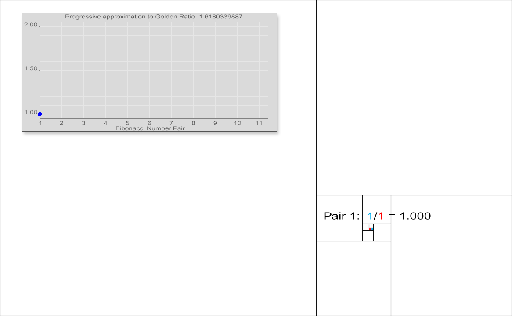

# Square Root Integers for AMM Quantascale (Solidity Experiment)

## Preamble

This is the second draft of a series that is using AI to explore and survey AMM efficiencies using "Base Scale Calculus" number theory philosophy, namely the "Square Root Integers" officially published in the Online Encyclopedia of Integer Sequences ("OEIS") at [https://oeis.org/search?q=kyle+maclean+smith&language=english&go=Search](https://oeis.org/search?q=kyle+maclean+smith&language=english&go=Search) and comprehensively listed on [https://github.com/bestape#oeis-contributions](https://github.com/bestape#oeis-contributions), including the "Mold & Cast Strings" editor notes hidden within the pyramorphix sequence's history: [https://oeis.org/history?seq=A330399&start=10](https://oeis.org/history?seq=A330399&start=10).

<br />

This draft is a fast-turnaround minimum viable demo by an individual inventor accelerating with AI no more proficient than early-release ChatGPT 5 and Nora.ai v0.4.4. This publication has gone through limited review. It is meant to encourage others to get involved with this technology academically or in industry, who can help create end-products. This publication is not intended to be an end-product academically or in industry.

The first draft in this series can be found at [https://github.com/bestape/amm-test](https://github.com/bestape/amm-test).

## Intro

This README, with citation links locally at [Volatility-Aware Ticks in AMMs (Solidity Experiment).pdf](./Volatility-Aware%20Ticks%20in%20AMMs%20%28Solidity%20Experiment%29.pdf) and cosmically at [https://chatgpt.com/s/dr_68ba59016a54819190f1d62a7086ee8f](https://chatgpt.com/s/dr_68ba59016a54819190f1d62a7086ee8f), analyzes how our Solidity prototype — which demonstrates the first generalized **single-sequence integer recurrence approximation of square root "irrationality"** discovery on OEIS in 2019 — could inform automated market maker ("AMM") design, especially in concentrated-liquidity pools.

In Uniswap-style AMMs, each “tick” is a fixed price step: by convention 1 tick = 0.01% price change (a 1.0001× multiplier). The contract’s ability to approximate such fine-grained exponents (for example, using inputs like `(1, 10001, 2)` to approximate the factor 1.0001) means we can generate small price increments on-chain. Below we discuss how tick spacing might vary by token type, and how a hybrid Newton-Raphson method could later be explored as a refinement step.

<br />

The static local version is at [squareRootIntegers.sol](./squareRootIntegers.sol) and a cosmo live version is at [https://arbitrum.blockscout.com/address/0x4dE228A1dF2735250Dc193f1B5484A3E54d087a4?tab=read_write_contract](https://arbitrum.blockscout.com/address/0x4dE228A1dF2735250Dc193f1B5484A3E54d087a4?tab=read_write_contract)


## Inputs

The inputs are `k`, `m` and `level`.

<br />

### k and m Inputs

`k` and `m` map to the approximation of `1 + k*sqrt(m) = 1 + sqrt(k^2 * m)`.

### Level Input

The level determines how accurate `a(n)/a(n-1)` has to get before the sequence generator ends. Here are the levels:

```
/// @notice Map 0-7 scale to Q64.64 tolerance
function tolFromLevel(uint8 level) internal pure returns (int256) {
    if (level == 0) return int256(ONE_Q64_64 / 1);      // ~100%
    if (level == 1) return int256(ONE_Q64_64 / 10);     // ~10%
    if (level == 2) return int256(ONE_Q64_64 / 100);    // ~1%
    if (level == 3) return int256(ONE_Q64_64 / 10000);  // ~0.01%
    if (level == 4) return int256(ONE_Q64_64 / 1000000);// ~0.0001%
    if (level == 5) return int256(1 << 10);             // near full Q64.64
    if (level == 6) return int256(1 << 5);
    if (level == 7) return int256(1);
    revert("level must be 0-7");
}
```

## Outputs

<br />

For inputs `(k=2, m=5, level=2)`, the contract returned:

```
n = 12
a_n_str = 683020169
a_n_minus_1_str = 124741545
result_str = 5.475482679006420835
```

### How to interpret this

- **Target value:**  
  We are approximating  
  \[
  1 + 2sqrt{5} approx 5.472135955
  \]

- **Sequence values:**  
  - `a_n_str` and `a_n_minus_1_str` are the 12th and 11th terms of the integer recurrence, *after being formatted into decimals*.  
  - They are **not raw Q64.64 values** — the contract internally uses Q64.64 for precision, but then converts them into human-readable decimal strings.

- **Ratio:**  
  The approximation is given by  
  \[
  frac{a_{12}}{a_{11}} = frac{683{,}020{,}169}{124{,}741{,}545} \;approx\; 5.475482679
  \]
  which matches `result_str`.

- **Accuracy:**  
  The true target is 5.472135955, so the error is about **0.00335 (~0.06%)**, comfortably within the ~1% tolerance required by `level = 2`.

### Takeaway

The recurrence has converged by the 12th step (`n=12`) to a ratio very close to \(1 + 2sqrt{5}\). This shows how a single integer sequence, when ratioed against its predecessor, can efficiently approximate irrational values on-chain.

## Tick Spacing and Token Characteristics

AMMs can **tune tick granularity** to match token volatility and liquidity. Each tick step corresponds to a price ratio (Uniswap uses \(p(i)=1.0001^i\)). Narrow tick spacing (small percentage steps) boosts precision, while wider spacing reduces the number of steps crossed for large price moves. General guidelines are:

- **Stablecoin / low-volatility pairs:** Use very *narrow* ticks (fine granularity). Since stable pairs stay near a constant price, tighter spacing concentrates liquidity where trades happen.  Narrow spacing (e.g. 1-basis-point, 0.01% steps) improves capital efficiency and lowers slippage.
- **High-volatility assets:** Use *wider* ticks (coarser steps) to avoid frequent tick-crossing. For a highly volatile pair, large price swings would otherwise hit many ticks (adding gas cost), so larger steps reduce crossing frequency.
- **High-liquidity pools:** Can tolerate *narrow* spacing. When a pool has lots of liquidity, LPs can confidently concentrate it in tight ranges, so finer ticks are viable.
- **Low-liquidity pools:** Benefit from *wider* spacing. With little liquidity, each tick holds less depth; using larger steps avoids having extremely sparse liquidity at each tick.

These principles align with Uniswap’s design: tick spacing is tied to fee tiers and volatility. For example, Uniswap V3 governance added a 1 bps fee tier with tickSpacing=1 (0.01% steps) to better serve stablecoin pools. In contrast, high-fee (volatile) pools have larger tick spacing (e.g. 0.3% steps) to balance precision and gas efficiency.  

## Single-Sequence Square Root Approximations

The key novelty here is the use of a **single linear recurrence** of integers to approximate values of the form \(1 + k sqrt{m}\). This differs from classical Pell / Pell–Lucas methods, which require *two* interlinked sequences (numerator/denominator). By contrast, our approach uses just one sequence, making it simpler to implement in Solidity and cheaper on gas.

- *Example:* \(a(n) = 2a(n-1) + (m-1)a(n-2)\) has the property that \(a(n)/a(n-1) to 1 + sqrt{m}\).  
- More generally, variants like \(a(n) = 2a(n-1) + (k^2 m - 1)a(n-2)\) converge to \(1 + k sqrt{m}\).  

This allows a Solidity contract to generate rational approximations to square roots — which in turn can be used to define tick multipliers for AMMs.

This pattern is inspired by the Fibonacci approximations of the Golden Ratio, which is also the approximations of sqrt{5}. From [https://en.wikipedia.org/wiki/Fibonacci_sequence#/media/File:Fibonacci_tiling_of_the_plane_and_approximation_to_Golden_Ratio.gif](https://en.wikipedia.org/wiki/Fibonacci_sequence#/media/File:Fibonacci_tiling_of_the_plane_and_approximation_to_Golden_Ratio.gif):



## Example: Approximating a 1.0001 Tick

To illustrate, consider approximating the base tick factor 1.0001. Our contract can take an input like `(1, 10001, 2)` to generate the ratio \(a(n)/a(n-1)\) that converges near **1.0001**. This shows that even tiny multipliers can be encoded: by choosing the integer recurrence parameters appropriately, we can construct ticks at the granularity of 0.01% (or even smaller if desired).

The key point is that our implementation handles this with **only one integer sequence**, unlike Pell-based double-sequence constructions. This makes the Solidity implementation lightweight.

## Quantascale Philosophy

In today’s AMM design, the word **tick** is industry jargon. It marks a tiny step in price, often fixed by convention (e.g. 0.01%). Useful, but limited: ticks treat the market as if it were a staircase we build by governance vote.

History shows us that sometimes finance glimpses something deeper before physics names it. In 1900, **Louis Bachelier** modeled stock prices as continuous random walks — five years *before* Einstein framed Brownian motion as physical proof of atoms. Finance saw the jitter first; physics gave it universal language later.

AMMs may be in the same position today. If we only call these increments “ticks,” we stay at the level of industry shorthand. But if we see them instead as **quantascale**, we open the door to a richer understanding:

* **Spacetime–Scale Trifecta:**

  * *Space*: Liquidity across the price curve.
  * *Time*: Volatility as random walk.
  * *Scale*: The resolution at which on-chain math can express increments.

* **Ticks as Brownian precursors:**
  Ticks are today’s finance-first sighting, like Bachelier’s stock paths. They hint at an underlying structure — micro-motions within price space — that we haven’t yet fully theorized.

* **Quantascale as philosophy:**
  Quantascale treats increments not as arbitrary ladders but as **emergent recurrence grains** — the natural Brownian fabric of market space, captured by integer sequences like $1 + ksqrt{m}$.

If AMM design takes terminology seriously, it could provide the same kind of conceptual leap finance once gave physics. **Ticks are what we see; quantascale is what we might learn.**


## Implications for AMM Design

In summary, our Solidity experiment demonstrates that *adaptive tick spacing* and *on-chain recurrence-based math* can be combined in AMM technology. AMMs could allow tick size to vary by pool (or even adjust dynamically) based on token volatility or liquidity, beyond the fixed 1.0001 step. The recurrence-based approach gives deterministic integer-only approximations, which are gas-efficient.  

In the future, the **Newton-Raphson method** could be added as a refinement layer: once the recurrence provides a good approximation of \(sqrt{m}\), Newton-Raphson iterations could converge even faster to high precision. This hybrid approach (recurrence baseline + Newton-Raphson refinement) may be the optimal trade-off between precision and gas.

## Further Reading

- **OEIS Research** in the local file [Known recurrence sequences for $1+\sqrt{m}$.pdf](./Known%20recurrence%20sequences%20for%20%241%2B_sqrt%20m%24.pdf), available cosmically at [[Known recurrence sequences for $1+\sqrt{m}$.pdf](./Known%20recurrence%20sequences%20for%20%241%2B_sqrt%20m%24.pdf)](https://chatgpt.com/share/68ba5836-e0c8-8008-a776-c6b856f86d51), provides more detail on the novelty and timestamp claims by **Kyle MacLean Smith**. It explains how single-sequence recurrences approximating \(1 + sqrt{m}\) (and \(1 + k sqrt{m}\)) were first recognized and generalized beyond Pell-type constructions.

- **Base Scale Tessellations** fixated on the legal engineering philosophy that Non-Fungible Tokens ("NFTs") should be the Domain Name System ("DNS") for Document Object Model ("DOM") iFrames called iNFTs: [https://ape.mirror.xyz/FjUVEcUrDmQISEmcVarGEDHt6mLK9VOjLbxXgFy4edE](https://ape.mirror.xyz/FjUVEcUrDmQISEmcVarGEDHt6mLK9VOjLbxXgFy4edE)


Generally, we believe DOMs are as fundamental an innovation to modern jurisprudence as papyrus, pen or printer, respectively in chronology. DOMs are the runtime of markup and markup was **made by a lawyer for lawyers** as to electrify legalese languages and, therefore, enter the age of legal abundance with 99% deflated costs as we've enjoyed in transport since the Oregon Trail.


<br />

- **Base Scale Calculus** becoming a #mathpunk tradition: [https://x.com/bestape/status/1960190121631776985](https://x.com/bestape/status/1960190121631776985) 

- **References:** Uniswap and Orca docs on ticks; Uniswap’s tick-fee design; Curve’s on-chain math discussion.

[](https://x.com/bestape/status/1963995595309289662)

